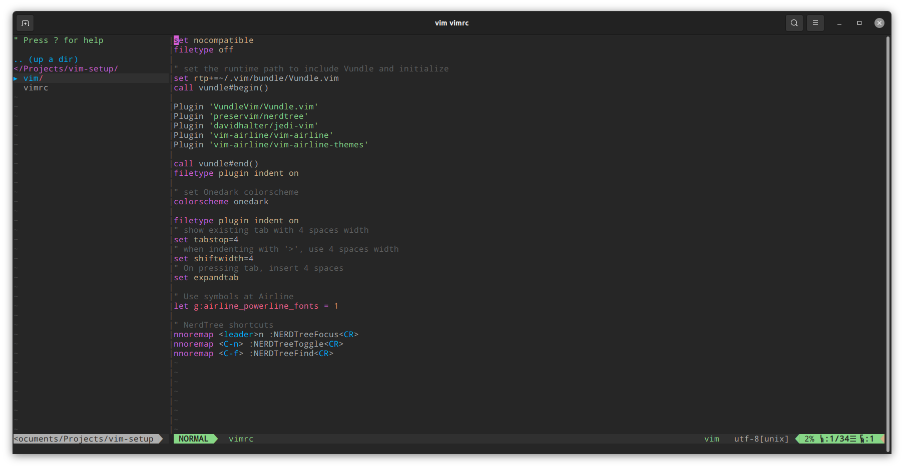

### My VIM config

Just make sure that you have Vundle installed.

    git clone https://github.com/VundleVim/Vundle.vim.git ~/.vim/bundle/Vundle.vim

[Vundle] (https://github.com/VundleVim/Vundle.vim)

