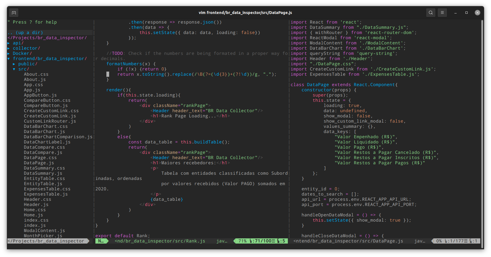

### My VIM config

This vimrc uses Vundle as Plugin Manager!

#### Plugins used:

[Vundle](https://github.com/VundleVim/Vundle.vim)

[NERDTree](https://github.com/preservim/nerdtree)

[Jedi-VIM](https://github.com/davidhalter/jedi-vim)

[VIM-Airline](https://github.com/vim-airline/vim-airline)

[VIM-Airline-Themes](https://github.com/vim-airline/vim-airline-themes)

[VIM-Polyglot](https://github.com/sheerun/vim-polyglot)

[VIM-JavaScript](https://github.com/pangloss/vim-javascript)

### How to install:

Install Vundle:
    
    git clone https://github.com/VundleVim/Vundle.vim.git ~/.vim/bundle/Vundle.vim

Copy files:

    git clone https://github.com/carlosplf/vim-setup
    cd vim-setup/
    cp vimrc ~/.vimrc
    cp -r vim/colors ~/.vim/
    cp -r vim/autoload ~/.vim/

Open VIM and install Plugins:

    :PluginInstall

